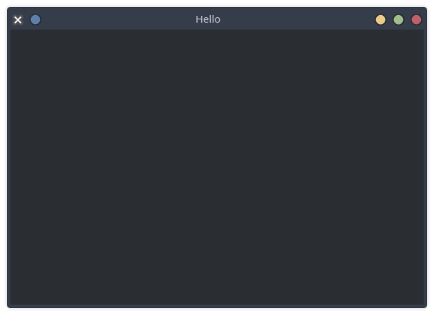
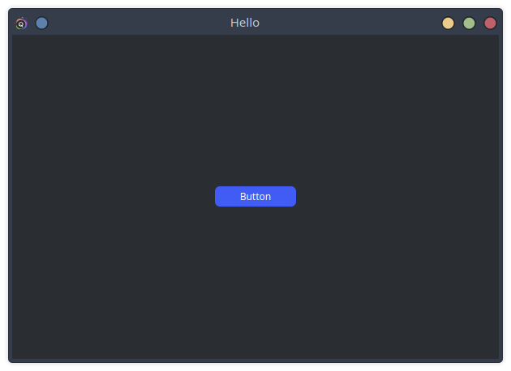
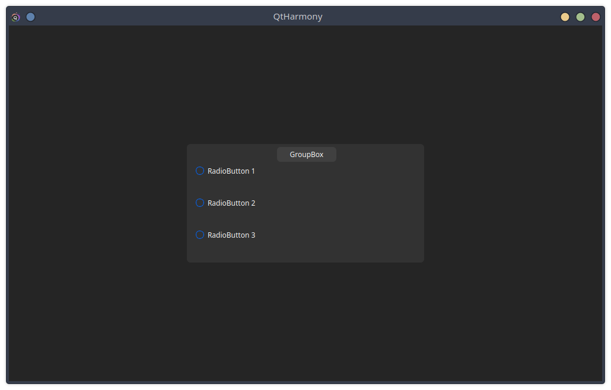

<p align="center">
    
</p>
<h1></h1>

<p align="center">

  
  
   
  
  
  
</p>

<b>QtHarmony</b> - is a Cutting-Edge GUI Library Built on PyQt6 QtHarmony 
is a intuitive graphical user interface (GUI) library designed 
to simplify the development of modern, visually stunning, and highly functional applications. 
Built on the robust foundation of PyQt6. Now QtHarmony is in development.

<h3>How to use</h3>

```sh
pip install QtHarmony
```

```python
from qtharmony.constructor import Initialization
from qtharmony.widgets import ...
...
```

<h3>Examples</h3>
<h4>Basic screen</h4>

```python
from qtharmony.constructor import Initialization
from qtharmony.windows import MainWindow

import sys


Initialization.init(sys.argv)


if __name__ == "__main__":
    window = MainWindow(title="Hello", size=(600, 400))
    window.run()

    Initialization.exec()

```



<h4>To change theme</h4>

```python
from qtharmony.widgets import *
from qtharmony.windows import MainWindow
from qtharmony.constructor import Initialization
from qtharmony.src.core.theme import ThemeManager


Initialization.init(sys.argv)
ThemeManager.change_theme("Dark-Green")

...
```

<h4>Button</h4>

```python
from qtharmony.constructor import Initialization
from qtharmony.windows import MainWindow
from qtharmony.widgets import PushButton

from PySide6.QtWidgets import QWidget, QHBoxLayout

import sys


Initialization.init(sys.argv)


class Widget(QWidget):
    def __init__(self) -> None:
        super().__init__()

        self.mainLayout = QHBoxLayout()
        self.mainLayout.addWidget(PushButton("Button"))
        self.setLayout(self.mainLayout)


if __name__ == "__main__":
    window = MainWindow(widget=Widget(), title="Hello", size=(600, 400))
    window.run()

    Initialization.exec()
```



<h3>Other Examples</h3>

